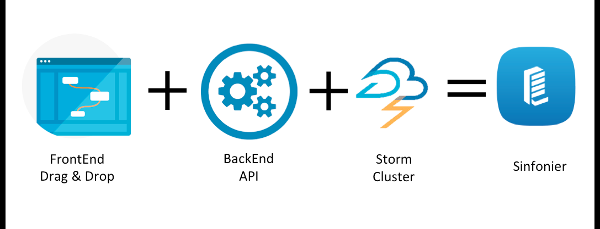

# Sinfonier API



Sinfonier API was develop to deal with Apache Storm cluster.

Sinfonier:

> Sinfonier is a change in the focus in respect to current solutions in the area of processing information in real-time. We combine an easy-to-use interface, modular and adaptable, and we integrate it with an advanced technological solution to allow you to do the necessary tune up suitable for your needs in matters of information security.

Apache Storm:

> Apache Storm is a free and open source distributed real time computation system. Storm makes it easy to reliably process unbounded streams of data, doing for real time processing what Hadoop did for batch processing. Storm is simple, can be used with any programming language, and is a lot of fun to use!

# Description

* Compile modules
* Manage Sinfonier Backend
* Start/Stop Storm topologies
* Storm Log management

# Installation
## Python dependencies

```bash
$ sudo pip install -r requirements
```

# Configuration
You can set up everything relate to the system in `config/environmentConfig/`, even adding new environments. Currently you have available these environments: develop, docker and production.
We use some environment vars to configure the system, so you may want to do this:

```sh
# These two var are mandatory if you haven't exported it to your PATH var before
export MAVEN_HOME=/path/to/maven
export STORM_HOME=/path/to/storm
```

**Make sure the log folder exits**, if not, app will crash.

# Deploy

## From source

```bash
$ git clone git@github.com:telefonicaid/fiware-sinfonier.git
$ cd fiware-sinfonier/sinfonier-backend-api
$ python sinfonierapi.py
```

## Project leads
* Rodolfo Bordón Villar <rodolfo.bordon@11paths.com>

## Committers

* Alberto J. Sanchez @ajsanchezsanz https://github.com/ajsanchezsanz
* Jose Miguel Díez de la Lastra <jmdiez@aspgems.com>
* Alejandro Matos Caballero https://github.com/amatosc/
* Jesús Torres @velatorre <velatorre@msn.com>

## Contributors

## License

Apache License, Version 2.0: http://www.apache.org/licenses/LICENSE-2.0

## References
* http://storm.apache.org/
* https://maven.apache.org/
