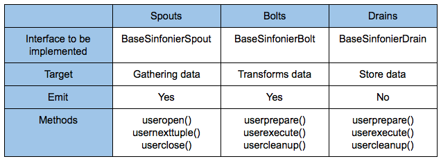

SINFONIER BACKEND
=================


Sinfonier BackEnd allow to deploy Apache Storm Topologies defined using JSON into Apache Storm Cluster. It's the final step on Sinfonier Project architecture and It's used by [Sinfonier API](https://github.com/telefonicaid/fiware-sinfonier/sinfonier-backend-api)


Clone repository
```sh
git clone git@github.com:telefonicaid/fiware-sinfonier.git
cd fiware-sinfonier/sinfonier-backend
```
    

Configure in Sinfonier API this paths and start using Apache Storm in the simplest way.


## Installation
    
```sh
cd sinfonier-backend
mvn clean compile package
# For installation in local
# mvn install:install-file -Dfile=target/sinfonier-backend-1.1.0.jar -DgroupId=com.sinfonier -DartifactId=sinfonier-backend -Dversion=1.1.0 -Dpackaging=jar 
# For installation in remote
mvn deploy:deploy-file -Dfile=target/sinfonier-backend-1.1.0.jar -DgroupId=com.sinfonier -DartifactId=sinfonier-backend -Dversion=1.1.0 -Dpackaging=jar -DrepositoryId=central -Durl=http://yourmavenserver/artifactory/libs-release-local
```

## Data Model

One of the requirements to implement a collaborative system like Sinfonier is to ensure all modules are able to communicate. For this reason Sinfonier defines a data model based on a single JSON tuple instead of Apache Storm data model based on an indeterminate number of tuples <K,V>.

This approach allow users to share and use others user’s modules into the platform and Sinfonier includes an API to manage this JSON tuple in a simple way. Allowing users to add new fields, remove fields and check fields exists. API current support Java and Python language.



## JAVA API

Spouts

```java
/**
  * Get param from module configuration file.
  */
public String getParam(String param)

/**
 * Get param from module, check if is null and if is null, throw an exception
 */
public String getParam(String param, boolean checkNotNull)

/**
 * Get list of property from module parameters configuration.
 */
public List<Object> getParamList(String param)
 
/**
 * Add field to tuple.
 */
public void addField(String key, Object value)
 
/**
 * Divide key in parts (split by '.'), access to nested documents or create them if doesn't
 * exists and finally adds the key.
 */
public void addNestedField(String key, Object value)
 
/**
 * Get field from tuple.
 */
public Object getField(String key)


/**
 * Remove a field from tuple.
 */
public void removeField(String key)


/**
 * Check if exists field corresponding to given key.
 */
public boolean existsField(String key)

/**
 * Set new Entity to tuple.
 */
public void setEntity(String entity)

/**
 * Get mapper to manage and transform to JSON.
 */
public ObjectMapper getMapper()

/**
 * Set current tuple in json raw format.
 */
public void setJson(String json)
```

Bolts and Drains

```java
/**
 * Replace current tuple by given tuple. Useful if you make deep changes in tuple.
 */
public void setJSon(Map<String, Object> json)

/**
 * Get param from module configuration file.
 */
public String getParam(String param)

/**
 * Get param from module configuration, check if is null and if is null, throw an exception.
 */
public String getParam(String param, boolean checkNotNull)

/**
 * Get list of property from xml configuration.
 */
public List<Object> getParamList(String param)

/**
 * Add field to tuple.
 */
public void addField(String key, Object value)

/**
 * Divide key in parts (split by '.'), access to nested documents or create them if doesn't
 * exists and finally adds the key.
 */
public void addNestedField(String key, Object value)

/**
 * Get field from tuple.
 */
public Object getField(String key)
 

/**
 * Remove a field from tuple.
 */
public void removeField(String key)

/**
 * Check if exists field corresponding to given key.
 */
public boolean existsField(String key)

/**
 * Get current tuple in a {@link java.util.Map}.
 */
public Map<String, Object> getJson()

/**
 * Current tuple in raw string json.
 */
public String getRawJson()

/**
 * Set name of entity tuple to emit to the next component.
 */
public void setEntity(String name)

/**
 * Retrieve entity name.
 */
public String getEntity() 
```

## PYTHON API

## Project leads

* Rodolfo Bordón Villar <rodolfo.bordon@11paths.com>

## Committers

* Alberto J. Sanchez @ajsanchezsanz https://github.com/ajsanchezsanz
* Jose Miguel Díez de la Lastra https://github.com/demonodojo
* Jesús Torres @velatorre https://github.com/velatorre

## Contributors
    * Alejandro Matos Caballero https://github.com/amatosc/

## License
Apache License, Version 2.0: http://www.apache.org/licenses/LICENSE-2.0